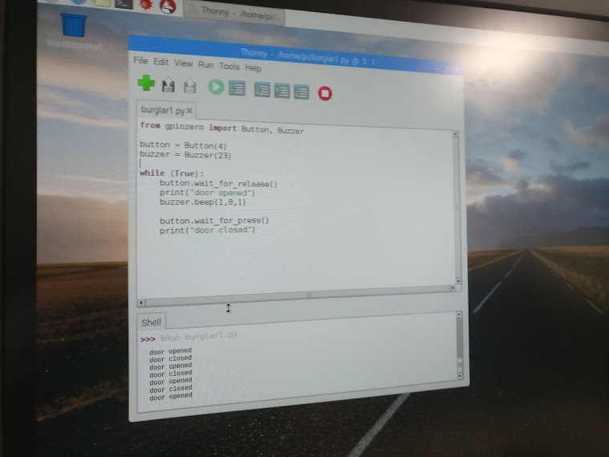
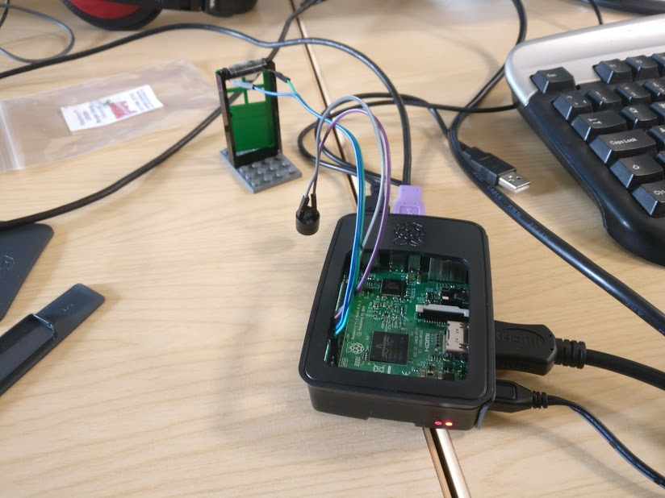

# LEGO-burglar-alarm-rpi3
LEGO® burglar alarm using the Raspberry Pi 3 (courtesy of [Cotswold Jam](http://www.cotswoldjam.org/)). The original files can be found [here](http://www.cotswoldjam.org/downloads/2016-04/).

The code uses the [GPIOZero](https://github.com/RPi-Distro/python-gpiozero/) library with some accompanying Python 3 code and the following components:

* 4 female-female GPIO jumper cables (also called DuPont cables, preferably of different colours)
* A small low-voltage piezo buzzer
* 3 LEGO® pieces - 1×4×6 stud door ([60623](https://www.bricklink.com/v2/catalog/catalogitem.page?id=78043#T=C)), 1×4×6 stud door frame ([60596](https://www.bricklink.com/v2/catalog/catalogitem.page?P=60596#T=C)), 4×6 stud plate ([3032](https://www.bricklink.com/v2/catalog/catalogitem.page?P=3032#T=C))
* A low-voltage glass reed switch
* A small neodymnium magnet
* Sellotape®

Use one of the many Python IDEs preinstalled on the Raspberry Pi. I personally use [Thonny](http://thonny.org/), but [IDLE](https://www.python.org/downloads/) works well too.

## Licensing
Andrew Oakley, the tutorial's author licensed the code and instructions in the public domain. To simplify things, I have formally licensed the code and documenation in this repository under the **Creative Commons Zero 1.0 Universal (CC0 1.0)**.

There is also a disclaimer on the documentation that the tutorial isn't *sponsored, authorized or endorsed by the LEGO Group*. Sellotape® are also unlikely to endorse this tutorial as well.

## And FINALLY
If you love this tutorial, please drop a donation to Cotswold Jam. :-)

## Photos

 
